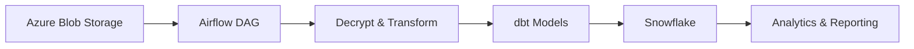

# Australian Ethical Data Engineering Interview Project

This starter project mirrors the interview scenario: ingest an encrypted Parquet file from Azure Blob Storage, decrypt and transform it, and load it into Snowflake for analytics.

## Scenario Summary

A small data engineering team needs a production-ready pipeline that:
- ingests an encrypted Parquet file from Azure Blob Storage,
- decrypts and transforms the data,
- loads the result into Snowflake,
- is orchestrated with Airflow,
- follows strong security and governance principles.

## Project Structure

- docs/architecture.md — architecture and design notes
- src/pipeline — Python modules for ingestion, decryption, and Snowflake loading
- airflow/dags — Airflow DAG skeleton
- dbt/models — dbt staging model example

## Architecture Overview

## Quick Start

1. Copy .env.example to .env and fill in your values.
2. Install dependencies:
   pip install -r requirements.txt
3. Review the architecture notes in docs/architecture.md.
4. Use the Airflow DAG as the orchestration starting point for the interview solution.

## Security & Governance Notes

- Use Azure Key Vault or managed secrets for encryption keys and credentials.
- Encrypt data in transit with TLS and at rest in Azure and Snowflake.
- Apply Snowflake RBAC with separate roles for ingestion, transformation, and reporting.
- Add data quality tests and monitoring hooks before production rollout.
